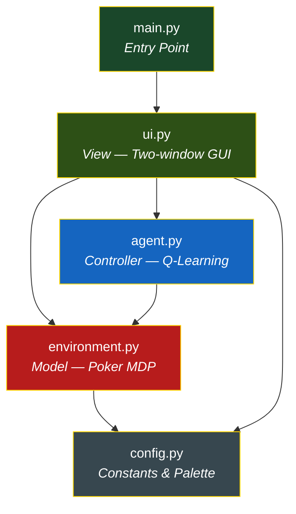
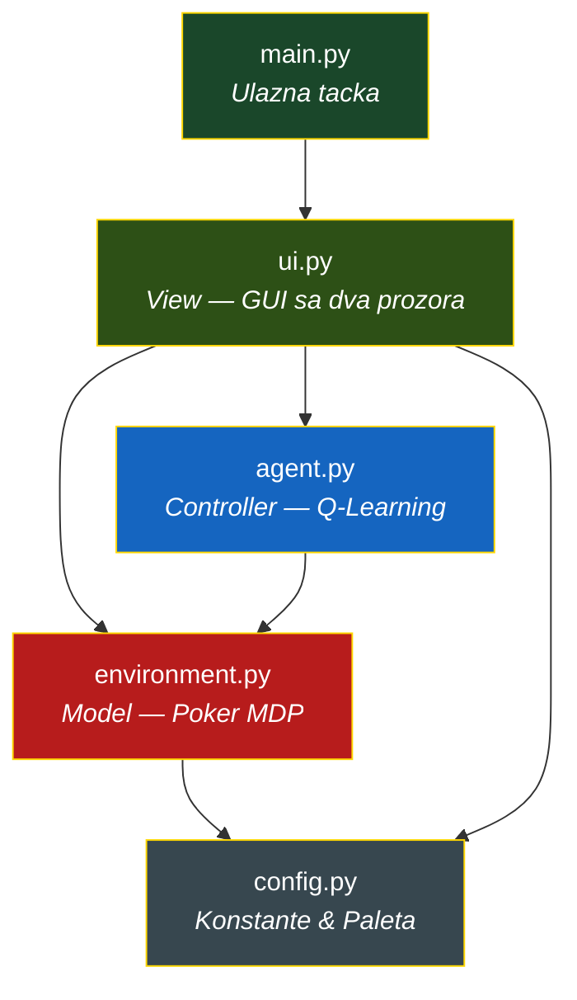

<div align="center">

# Texas Hold'em -- Q-Learning Lab

<br/>

### Choose your language / Izaberite jezik

<a href="#-english-version">
  
</a>
&nbsp;&nbsp;&nbsp;
<a href="#-srpska-verzija">
  
</a>

</div>

---
---

<br/>

<h1 id="-english-version">🇬🇧 English Version</h1>

## Overview

A Reinforcement Learning agent for simplified Heads-Up Texas Hold'em poker.

A Q-Learning agent learns the optimal post-flop strategy for a fixed hero hand
(8&#9829; 9&#9829;) on a flop of (J&#9829; Q&#9829; 2&#9827;) -- a combined
flush draw and open-ended straight draw with approximately 15 outs and ~54%
equity to improve by the river.  The agent trains over thousands of episodes
against a stochastic opponent, builds a Q-table, and then plays autonomously
inside a two-window CustomTkinter GUI.

---

## Architecture

The project follows a strict **Model-Controller-View** separation across five
files with zero circular dependencies.

```
main.py ──> ui.py (View) ──> agent.py (Controller) ──> environment.py (Model) ──> config.py
```



| File | Role | Lines | Responsibility |
|------|------|------:|----------------|
| `config.py` | Constants | ~155 | Every magic number, colour token, and hyperparameter default |
| `environment.py` | Model | ~720 | Card representation, hand evaluator (BGC-compliant), opponent policy, MDP engine |
| `agent.py` | Controller | ~335 | Q-table, epsilon-greedy action selection, Bellman update, training loop |
| `ui.py` | View | ~1470 | Poker Table window, Train & Analyse window, timer management |
| `main.py` | Entry | ~25 | Instantiates `PokerGUI` and calls `run()` |

---

## The Reinforcement Learning Core

### State-Action-Reward Loop

The environment is modelled as a **Markov Decision Process** where the agent
(Hero) interacts with a fixed stochastic opponent embedded in the environment
itself -- analogous to the Dealer in Blackjack.

```
    ┌─────────────────────────────────────────────┐
    │               ENVIRONMENT                   │
    │  ┌─────────┐  ┌──────────┐  ┌───────────┐  │
    │  │ Deck &  │  │ Opponent │  │ Showdown  │  │
    │  │ Board   │  │ Policy   │  │ Evaluator │  │
    │  └─────────┘  └──────────┘  └───────────┘  │
    └──────────┬──────────────────────┬───────────┘
               │  state(s)           │ reward(r)
               ▼                     ▲
    ┌──────────────────────────────────────────────┐
    │                 Q-LEARNING AGENT             │
    │                                              │
    │   Q(s,a) <-- Q(s,a) + a[r + g*max(Q) - Q]   │
    │                                              │
    │   policy: e-greedy over Q-table              │
    └──────────────────┬───────────────────────────┘
                       │  action(a)
                       ▼
                  ENVIRONMENT
```

### State Space

Each state is encoded as a compact string key:

```
"<street>_<pot>_<hero_stack>"
```

| Component | Values | Example |
|-----------|--------|---------|
| Street | `flop`, `turn`, `river` | `turn` |
| Pot | Running total in $ | `200` |
| Hero Stack | Remaining chips in $ | `100` |

Example state key: `"turn_200_100"` -- the Turn card is on the board, the pot
holds $200, and Hero has $100 remaining.  This abstraction keeps the Q-table
small (~20-30 unique states) while preserving the essential decision variables.

### Action Space

Five atomic actions are available to the agent on each decision point:

| Action | Code | Effect |
|--------|------|--------|
| Fold | `fold` | Surrender -- lose all invested chips |
| Check / Call | `call` | Match the opponent's current bet (or check if $0) |
| Raise $50 | `raise_50` | Call + add $50 on top |
| Raise $100 | `raise_100` | Call + add $100 on top |
| All-In | `raise_150` | Push entire remaining stack |

Action availability is dynamic -- `raise_100` is only valid when Hero has at
least $100 remaining.  The `raise_150` label always means "push whatever is
left", even if that is less than $150.

### Reward Signal

```
R = hero_final_stack - INITIAL_STACK
```

| Outcome | Typical Reward |
|---------|----------------|
| Hero wins showdown (no raises) | +$100 |
| Hero wins after raising $50 | +$150 |
| Hero folds on flop | -$0 (lost nothing beyond the initial pot) |
| Hero loses showdown (called $100) | -$100 |
| Hero loses all-in | -$150 |

The reward is zero-centered around the initial stack of $150, making it
immediately interpretable as profit or loss.

---

## The Atomic Turn Architecture

The engine enforces a strict **one-action-per-call** protocol.  No function
ever executes more than one player action.

### Street Settlement Rules

The settlement logic differs by street to guarantee correct game flow:

```
 FLOP / TURN                          RIVER
 ──────────                          ─────
 Opponent opens (check/raise)        Opponent opens (check/raise)
       │                                   │
 Hero acts (any non-fold action)     Hero acts
       │                                   │
 STREET SETTLED IMMEDIATELY          Bets matched?
       │                              │          │
 "Deal Next Card" button appears    Yes          No
       │                              │          │
 Dealer deals Turn / River          SHOWDOWN   Opponent responds
                                                  │
                                              Bets matched?
                                               │        │
                                             Yes        ...
                                               │
                                            SHOWDOWN
```

**Flop and Turn:** Hero's non-fold action always settles the street immediately.
The Dealer must deal the next community card before any further action occurs.

**River:** The standard poker rule applies -- both players must act and bets must
be equal (or a player must be all-in) before proceeding to showdown.

### Settled Board State

When a street settles, the engine freezes all action:

```
  ┌─────────────────────────────────────────────────────────────┐
  │                     BOARD STATE: SETTLED                    │
  ├──────────┬────────────┬───────────┬─────────────────────────┤
  │  Street  │  Hero Bet  │  Opp Bet  │  Status                │
  ├──────────┼────────────┼───────────┼─────────────────────────┤
  │  FLOP    │    $50     │    $0     │  street_settled = True  │
  │          │            │           │  valid_actions = []     │
  │          │            │           │  >> "Deal Next Card"    │
  └──────────┴────────────┴───────────┴─────────────────────────┘

  After advance_street():

  ┌─────────────────────────────────────────────────────────────┐
  │                    BOARD STATE: TURN OPEN                   │
  ├──────────┬────────────┬───────────┬─────────────────────────┤
  │  Street  │  Hero Bet  │  Opp Bet  │  Status                │
  ├──────────┼────────────┼───────────┼─────────────────────────┤
  │  TURN    │    $0      │    $0     │  street_settled = False │
  │          │            │           │  Opponent opens action  │
  └──────────┴────────────┴───────────┴─────────────────────────┘
```

The `street_settled` flag acts as a hard gate:
- `get_valid_actions()` returns `[]` while the flag is set.
- No player can act until the caller invokes `advance_street()`.
- The UI shows the "Deal Next Card" button; in Watch AI mode it auto-clicks.

### River Showdown -- Bets-Matched Logic

On the river, the engine checks three conditions before proceeding to showdown:

```
bets_matched = (
    hero_acted AND opp_acted
    AND (
        hero_street_bet == opp_street_bet          -- normal call
        OR (hero_stack == 0
            AND hero_bet <= opp_bet)                -- all-in for less
        OR (hero_stack == 0 AND opp_stack == 0)     -- both all-in
    )
)
```

This handles edge cases like a player going all-in for less than the opponent's
bet -- the bet difference is accepted and play proceeds to showdown.

---

## Q-Learning Implementation

### The Bellman Update

```
Q(s, a) <-- Q(s, a) + alpha * [ r + gamma * max Q(s', a') - Q(s, a) ]
                                          a'
```

| Symbol | Name | Default | Role |
|--------|------|---------|------|
| alpha | Learning Rate | 0.10 | How fast Q-values update |
| gamma | Discount Factor | 0.95 | Weight of future rewards |
| epsilon | Exploration Rate | 0.20 | Probability of random action |

### Training Loop (One Episode)

```
 reset() --> state s0
     │
     ▼
 ┌──────────────────────────────────┐
 │  While not done:                 │
 │                                  │
 │  if current_player == opponent:  │
 │      step_opponent()             │
 │                                  │
 │  if current_player == hero:      │
 │      a = epsilon_greedy(s)       │
 │      step(a) --> s', r, done     │
 │                                  │
 │      if street_settled:          │
 │          advance_street()        │◄── Advance BEFORE Q-update
 │          s' = new street state   │    so Q(flop) sees Q(turn)
 │                                  │
 │      Q(s,a) += alpha * [         │
 │        r + gamma*max(Q(s'))      │
 │        - Q(s,a)                  │
 │      ]                           │
 │      s = s'                      │
 └──────────────────────────────────┘
```

The critical detail: when Hero acts on the flop or turn and the street settles,
the training loop calls `advance_street()` **before** the Q-update.  This
ensures that `Q(flop_state, action)` is updated using the Q-values of the
**next street's** state (which carries real learned values), rather than the
dead settled state where `max Q(s') = 0`.

Without this, all flop and turn Q-values converge to zero and the agent only
learns on the river -- losing critical strategic depth.

### Convergence Insight

Hero holds 8&#9829; 9&#9829; on a J&#9829; Q&#9829; 2&#9827; flop:

- **Flush draw:** 9 remaining hearts (9 outs)
- **Straight draw:** Needs T or K (8 outs, minus overlaps)
- **Combined unique outs:** ~15
- **Equity to improve by river:** ~54%

The agent should converge to favouring **call** and moderate **raises** on
early streets, building pot equity with the draw, and playing aggressively on
the river when the hand completes.

---

## Hand Ranking Engine

The evaluator follows the **BGC (British Gambling Commission) Texas Hold'em**
hierarchy, implemented as a best-of-7 combinatorial evaluator:

| Rank | Hand | Example |
|-----:|------|---------|
| 10 | Royal Flush | A&#9829; K&#9829; Q&#9829; J&#9829; T&#9829; |
| 9 | Straight Flush | 9&#9827; 8&#9827; 7&#9827; 6&#9827; 5&#9827; |
| 8 | Four of a Kind | K K K K 3 |
| 7 | Full House | Q Q Q 7 7 |
| 6 | Flush | A&#9830; T&#9830; 8&#9830; 5&#9830; 2&#9830; |
| 5 | Straight | T 9 8 7 6 |
| 4 | Three of a Kind | 8 8 8 A J |
| 3 | Two Pair | A A 9 9 K |
| 2 | One Pair | J J A Q 4 |
| 1 | High Card | A K 9 7 3 |

Ace dynamics: high in `A K Q J T`, low in `5 4 3 2 A` (the wheel).

Tie resolution: when ranks are equal, kicker comparison uses ordered tiebreaker
tuples.  On exact ties the pot is split with the odd chip going to Hero
(player left of the dealer, per BGC rules).

---

## Opponent Policy

The opponent is a **fixed stochastic policy** embedded in the environment --
not a learning agent.  It is part of the environment dynamics, similar to the
Dealer in Blackjack.

| Parameter | Default | Behaviour |
|-----------|---------|-----------|
| `aggression` | 0.30 | Probability of raising $100 when able |
| `fold_prob` | 0.10 | Probability of folding when facing a bet |

Decision priority: Fold check --> Raise check --> Default to Call.

---

## GUI Overview

Two-window CustomTkinter interface with dark theme:

**Poker Table** (primary window):
- Card widgets with suit-coloured symbols
- Real-time AI Thought Process panel (Q-value bar chart)
- Action log tracking every move
- Three modes: Manual Play, Watch AI, Next Hand

**Train & Analyse** (secondary window):
- Hyperparameter controls (alpha, gamma, epsilon, episodes)
- Training progress bar
- Four analytics tabs: Win Rate, Reward History, Q-Table Heatmap, Q-Table Grid

Timer management uses a tracked `_schedule()` / `_cancel_pending()` system to
prevent ghost callbacks and race conditions between UI events.

---

## Setup & Run

**1. Install dependencies:**

```bash
pip install -r requirements.txt
```

**2. Clone and enter the project:**

```bash
git clone <repository-url>
cd TexasHoldEm
```

**3. Run:**

```bash
python main.py
```

The Poker Table and Train & Analyse windows open side by side.  Train the agent
first (recommended: 10,000+ episodes), then use Watch AI Play to observe the
learned strategy in action.

---

## Project Structure

```
TexasHold'em/
├── main.py            # Entry point
├── config.py          # All constants and theme tokens
├── environment.py     # Poker MDP engine + hand evaluator
├── agent.py           # Q-Learning agent
└── ui.py              # Two-window CustomTkinter GUI
```

---

<div align="right">
  <a href="#texas-holdem----q-learning-lab">⬆ Back to top</a>
</div>

<br/><br/>

---
---

<br/>

<h1 id="-srpska-verzija">🇷🇸 Srpska Verzija</h1>

## Pregled

**Reinforcement Learning agent za pojednostavljeni Heads-Up Texas Hold'em poker.**

Q-Learning agent uci optimalnu strategiju za post-flop igru sa fiksiranom
pocetnom rukom (8&#9829; 9&#9829;) na flopu (J&#9829; Q&#9829; 2&#9827;) --
kombinacija flush draw-a i open-ended straight draw-a sa priblizno 15 autova i
~54% equity-ja do river-a.  Agent trenira kroz hiljade epizoda protiv
stohastickog protivnika, gradi Q-tabelu i potom igra autonomno u GUI okruzenju
sa dva prozora (CustomTkinter).

---

## Arhitektura

Projekat prati striktnu **Model-Controller-View** separaciju kroz pet fajlova
bez cirkularnih zavisnosti.

```
main.py ──> ui.py (View) ──> agent.py (Controller) ──> environment.py (Model) ──> config.py
```



| Fajl | Uloga | Linije | Odgovornost |
|------|-------|-------:|-------------|
| `config.py` | Konstante | ~155 | Svi magicni brojevi, boje i podrazumevani hiperparametri |
| `environment.py` | Model | ~720 | Reprezentacija karata, evaluator ruku (BGC), politika protivnika, MDP engine |
| `agent.py` | Controller | ~335 | Q-tabela, epsilon-greedy selekcija, Bellman azuriranje, petlja treniranja |
| `ui.py` | View | ~1470 | Poker sto, Treniraj & Analiziraj prozor, upravljanje tajmerima |
| `main.py` | Ulaz | ~25 | Instancira `PokerGUI` i poziva `run()` |

---

## Jezgro Reinforcement Learning-a

### Petlja Stanje-Akcija-Nagrada

Okruzenje je modelovano kao **Markov Decision Process (MDP)** gde agent (Hero)
interaguje sa fiksiranim stohastickim protivnikom ugradjenim u samo
okruzenje -- analogno Dileru u Blackjack-u.

```
    ┌─────────────────────────────────────────────┐
    │               OKRUZENJE                     │
    │  ┌─────────┐  ┌──────────┐  ┌───────────┐  │
    │  │ Spil &  │  │Protivnik │  │ Showdown  │  │
    │  │ Board   │  │ Politika │  │ Evaluator │  │
    │  └─────────┘  └──────────┘  └───────────┘  │
    └──────────┬──────────────────────┬───────────┘
               │  stanje(s)          │ nagrada(r)
               ▼                     ▲
    ┌──────────────────────────────────────────────┐
    │               Q-LEARNING AGENT               │
    │                                              │
    │   Q(s,a) <-- Q(s,a) + a[r + g*max(Q) - Q]   │
    │                                              │
    │   politika: e-greedy nad Q-tabelom           │
    └──────────────────┬───────────────────────────┘
                       │  akcija(a)
                       ▼
                   OKRUZENJE
```

### Prostor Stanja

Svako stanje je kodirano kao kompaktan string kljuc:

```
"<ulica>_<pot>_<hero_stack>"
```

| Komponenta | Vrednosti | Primer |
|------------|-----------|--------|
| Ulica | `flop`, `turn`, `river` | `turn` |
| Pot | Ukupan iznos u $ | `200` |
| Hero Stack | Preostali cipovi u $ | `100` |

Primer kljuca stanja: `"turn_200_100"` -- Turn karta je na stolu, pot
sadrzi $200, a Hero ima $100.  Ova apstrakcija drzi Q-tabelu malom
(~20-30 jedinstvenih stanja) uz ocuvanje sustinskih varijabli odlucivanja.

### Prostor Akcija

Pet atomicnih akcija je dostupno agentu na svakoj tacki odlucivanja:

| Akcija | Kod | Efekat |
|--------|-----|--------|
| Fold | `fold` | Predaja -- gubitak svih ulozenih cipova |
| Check / Call | `call` | Izjednacavanje sa ulogom protivnika (ili check ako je $0) |
| Raise $50 | `raise_50` | Call + dodatnih $50 |
| Raise $100 | `raise_100` | Call + dodatnih $100 |
| All-In | `raise_150` | Gurni ceo preostali stack |

Dostupnost akcija je dinamicka -- `raise_100` je validan samo kada Hero ima
bar $100 preostalo.  Oznaka `raise_150` uvek znaci "gurni sve sto je ostalo",
cak i ako je to manje od $150.

### Signal Nagrade

```
R = hero_krajnji_stack - POCETNI_STACK
```

| Ishod | Tipicna Nagrada |
|-------|-----------------|
| Hero pobedjuje na showdown-u (bez raise-ova) | +$100 |
| Hero pobedjuje nakon raise-a $50 | +$150 |
| Hero fold-uje na flopu | -$0 (nije izgubio nista van pocetnog pot-a) |
| Hero gubi na showdown-u (call-ovao $100) | -$100 |
| Hero gubi all-in | -$150 |

Nagrada je centrirana oko nule u odnosu na pocetni stack od $150,
sto je cini direktno interpretabilnom kao profit ili gubitak.

---

## Arhitektura Atomicnog Poteza

Engine forsira strogi protokol **jedne-akcije-po-pozivu**.  Nijedna funkcija
nikada ne izvrsava vise od jedne akcije igraca.

### Pravila Zavrsetka Ulice

Logika zavrsetka se razlikuje po ulici kako bi se garantovao ispravan tok igre:

```
 FLOP / TURN                          RIVER
 ──────────                          ─────
 Protivnik otvara (check/raise)      Protivnik otvara (check/raise)
       │                                   │
 Hero igra (bilo koja ne-fold akcija) Hero igra
       │                                   │
 ULICA ZAVRSENA ODMAH                Ulozi izjednaceni?
       │                              │          │
 Dugme "Deal Next Card" se pojavi   Da           Ne
       │                              │          │
 Diler deli Turn / River            SHOWDOWN   Protivnik odgovara
                                                  │
                                              Ulozi izjednaceni?
                                               │        │
                                             Da         ...
                                               │
                                            SHOWDOWN
```

**Flop i Turn:** Hero-ova ne-fold akcija uvek zavrsava ulicu odmah.
Diler mora da podeli sledecu community kartu pre bilo kakve dalje akcije.

**River:** Primenjuje se standardno poker pravilo -- oba igraca moraju da
odigraju i ulozi moraju biti jednaki (ili igrac mora biti all-in) pre
prelaska na showdown.

### Stanje Zavrsetka

Kada se ulica zavrsi, engine zamrzava sve akcije:

```
  ┌─────────────────────────────────────────────────────────────┐
  │                   STANJE STOLA: ZAVRSENO                    │
  ├──────────┬────────────┬───────────┬─────────────────────────┤
  │  Ulica   │  Hero Ulog │  Opp Ulog │  Status                │
  ├──────────┼────────────┼───────────┼─────────────────────────┤
  │  FLOP    │    $50     │    $0     │  street_settled = True  │
  │          │            │           │  valid_actions = []     │
  │          │            │           │  >> "Deal Next Card"    │
  └──────────┴────────────┴───────────┴─────────────────────────┘

  Nakon advance_street():

  ┌─────────────────────────────────────────────────────────────┐
  │                  STANJE STOLA: TURN OTVOREN                 │
  ├──────────┬────────────┬───────────┬─────────────────────────┤
  │  Ulica   │  Hero Ulog │  Opp Ulog │  Status                │
  ├──────────┼────────────┼───────────┼─────────────────────────┤
  │  TURN    │    $0      │    $0     │  street_settled = False │
  │          │            │           │  Protivnik otvara       │
  └──────────┴────────────┴───────────┴─────────────────────────┘
```

Fleg `street_settled` deluje kao tvrda kapija:
- `get_valid_actions()` vraca `[]` dok je fleg postavljen.
- Nijedan igrac ne moze da igra dok pozivalac ne pozove `advance_street()`.
- UI prikazuje dugme "Deal Next Card"; u Watch AI modu se auto-klikne.

### River Showdown -- Logika Izjednacenih Uloga

Na river-u, engine proverava tri uslova pre prelaska na showdown:

```
bets_matched = (
    hero_odigrao AND opp_odigrao
    AND (
        hero_ulog_na_ulici == opp_ulog_na_ulici    -- normalan call
        OR (hero_stack == 0
            AND hero_ulog <= opp_ulog)              -- all-in za manje
        OR (hero_stack == 0 AND opp_stack == 0)     -- oba all-in
    )
)
```

Ovo pokriva granicne slucajeve poput igraca koji ide all-in za manje od
protivnikovog uloga -- razlika u ulozima se prihvata i igra ide na showdown.

---

## Q-Learning Implementacija

### Bellman Azuriranje

```
Q(s, a) <-- Q(s, a) + alpha * [ r + gamma * max Q(s', a') - Q(s, a) ]
                                          a'
```

| Simbol | Ime | Podrazumevano | Uloga |
|--------|-----|---------------|-------|
| alpha | Stopa ucenja | 0.10 | Koliko brzo se Q-vrednosti azuriraju |
| gamma | Faktor diskontovanja | 0.95 | Tezina buducih nagrada |
| epsilon | Stopa eksploracije | 0.20 | Verovatnoca nasumicne akcije |

### Petlja Treniranja (Jedna Epizoda)

```
 reset() --> stanje s0
     │
     ▼
 ┌──────────────────────────────────┐
 │  Dok nije kraj:                  │
 │                                  │
 │  ako current_player == protivnik:│
 │      step_opponent()             │
 │                                  │
 │  ako current_player == hero:     │
 │      a = epsilon_greedy(s)       │
 │      step(a) --> s', r, kraj     │
 │                                  │
 │      ako street_settled:         │
 │          advance_street()        │◄── Napreduj PRE Q-azuriranja
 │          s' = stanje nove ulice  │    da Q(flop) vidi Q(turn)
 │                                  │
 │      Q(s,a) += alpha * [         │
 │        r + gamma*max(Q(s'))      │
 │        - Q(s,a)                  │
 │      ]                           │
 │      s = s'                      │
 └──────────────────────────────────┘
```

Kritican detalj: kada Hero odigra na flopu ili turn-u i ulica se zavrsi,
petlja treniranja poziva `advance_street()` **pre** Q-azuriranja.  Ovo
osigurava da se `Q(flop_stanje, akcija)` azurira koristeci Q-vrednosti
stanja **sledece ulice** (koje nosi stvarne naucene vrednosti), umesto
mrtvog zavrsenog stanja gde je `max Q(s') = 0`.

Bez ovoga, sve Q-vrednosti flopa i turn-a konvergiraju ka nuli i agent
uci samo na river-u -- gubeci kriticnu stratesku dubinu.

### Uvid u Konvergenciju

Hero drzi 8&#9829; 9&#9829; na J&#9829; Q&#9829; 2&#9827; flopu:

- **Flush draw:** 9 preostalih herc karata (9 autova)
- **Straight draw:** Potreban T ili K (8 autova, minus preklapanja)
- **Kombinovani jedinstveni autovi:** ~15
- **Equity do poboljsanja do river-a:** ~54%

Agent bi trebalo da konvergira ka favorizovanju **call**-a i umerenih
**raise**-ova na ranim ulicama, gradeci pot equity sa draw-om, i igrajuci
agresivno na river-u kada se ruka kompletira.

---

## Engine za Rangiranje Ruku

Evaluator prati **BGC (British Gambling Commission) Texas Hold'em**
hijerarhiju, implementiran kao best-of-7 kombinatorni evaluator:

| Rang | Ruka | Primer |
|-----:|------|--------|
| 10 | Royal Flush | A&#9829; K&#9829; Q&#9829; J&#9829; T&#9829; |
| 9 | Straight Flush | 9&#9827; 8&#9827; 7&#9827; 6&#9827; 5&#9827; |
| 8 | Poker (Four of a Kind) | K K K K 3 |
| 7 | Full House | Q Q Q 7 7 |
| 6 | Flush | A&#9830; T&#9830; 8&#9830; 5&#9830; 2&#9830; |
| 5 | Kenta (Straight) | T 9 8 7 6 |
| 4 | Tris (Three of a Kind) | 8 8 8 A J |
| 3 | Dva Para (Two Pair) | A A 9 9 K |
| 2 | Par (One Pair) | J J A Q 4 |
| 1 | Najvisa Karta (High Card) | A K 9 7 3 |

Dinamika Keca: visok u `A K Q J T`, nizak u `5 4 3 2 A` (tockic).

Resavanje izjednacenja: kada su rangovi jednaki, poredjenje kicker-a koristi
uredjene tuple za razresavanje.  Na egzaktnim izjednacenjima pot se deli sa
neparnim cipom koji ide Hero-u (igrac levo od dilera, po BGC pravilima).

---

## Politika Protivnika

Protivnik je **fiksirana stohasticka politika** ugradjena u okruzenje --
nije agent koji uci.  On je deo dinamike okruzenja, slicno Dileru u
Blackjack-u.

| Parametar | Podrazumevano | Ponasanje |
|-----------|---------------|-----------|
| `aggression` | 0.30 | Verovatnoca raise-ovanja $100 kada je moguce |
| `fold_prob` | 0.10 | Verovatnoca fold-ovanja kada je suocen sa ulogom |

Prioritet odlucivanja: Provera fold-a --> Provera raise-a --> Podrazumevani Call.

---

## Pregled GUI-ja

Interfejs sa dva prozora (CustomTkinter) i tamnom temom:

**Poker Sto** (primarni prozor):
- Widget-i karata sa simbolima u boji masova
- AI Thought Process panel u realnom vremenu (bar chart Q-vrednosti)
- Dnevnik akcija koji prati svaki potez
- Tri moda: Rucna Igra, Gledaj AI, Sledeca Ruka

**Treniraj & Analiziraj** (sekundarni prozor):
- Kontrole hiperparametara (alpha, gamma, epsilon, epizode)
- Progress bar treniranja
- Cetiri analiticki tab-a: Win Rate, Istorija Nagrada, Q-Table Heatmap, Q-Table Grid

Upravljanje tajmerima koristi praceni `_schedule()` / `_cancel_pending()` sistem
za sprecavanje ghost callback-ova i race condition-a izmedju UI dogadjaja.

---

## Pokretanje

**1. Instalirajte zavisnosti:**

```bash
pip install -r requirements.txt
```

**2. Klonirajte i udjite u projekat:**

```bash
git clone <repository-url>
cd TexasHoldEm
```

**3. Pokrenite:**

```bash
python main.py
```

Poker Sto i Treniraj & Analiziraj prozori se otvaraju jedan pored drugog.
Prvo istrenirajte agenta (preporuka: 10.000+ epizoda), zatim koristite
Watch AI Play da posmatrate naucenu strategiju u akciji.

---

## Struktura Projekta

```
TexasHold'em/
├── main.py            # Ulazna tacka
├── config.py          # Sve konstante i tokeni tema
├── environment.py     # Poker MDP engine + evaluator ruku
├── agent.py           # Q-Learning agent
└── ui.py              # GUI sa dva prozora (CustomTkinter)
```

---

<div align="right">
  <a href="#texas-holdem----q-learning-lab">⬆ Nazad na vrh</a>
</div>

<br/>

---

*Built with Python 3.13, CustomTkinter, Matplotlib, NumPy.*
