<div align="center">

# Texas Hold'em -- Q-Learning Lab

<br/>

### Choose your language / Izaberite jezik

<a href="#-english-version">
  
</a>
&nbsp;&nbsp;&nbsp;
<a href="#-srpska-verzija">
  
</a>

</div>

---
---

<br/>

<h1 id="-english-version">🇬🇧 English Version</h1>

## Overview

A Reinforcement Learning agent for simplified Heads-Up Texas Hold'em poker.

A Q-Learning agent learns an optimal post-flop betting strategy by training
over thousands of episodes against a stochastic opponent.  In **stochastic
mode** (the default) hero cards and the flop are randomised every hand, so
the agent learns an average-case strategy across all possible hands rather
than memorising a single scenario.  A fixed-hand mode
(8&#9829; 9&#9829; on J&#9829; Q&#9829; 2&#9827;) is also available via
the `STOCHASTIC` flag in `config.py`.

The agent uses a **Monte Carlo backward pass** to credit every action in an
episode with a discounted return, enabling fast convergence of early-street
Q-values.  It then plays autonomously inside a two-window CustomTkinter GUI.

---

## Architecture

The project follows a strict **Model-Controller-View** separation across five
files with zero circular dependencies.

```
main.py ──> ui.py (View) ──> agent.py (Controller) ──> environment.py (Model) ──> config.py
```



```mermaid
graph TD
    MAIN["main.py<br/><i>Entry Point</i>"]
    UI["ui.py<br/><i>View — Two-window GUI</i>"]
    AGENT["agent.py<br/><i>Controller — Q-Learning</i>"]
    ENV["environment.py<br/><i>Model — Poker MDP</i>"]
    CFG["config.py<br/><i>Constants & Palette</i>"]

    MAIN --> UI
    UI --> AGENT
    UI --> ENV
    AGENT --> ENV
    ENV --> CFG
    UI --> CFG

    style MAIN fill:#1a472a,stroke:#ffd700,color:#fff
    style UI fill:#2d5016,stroke:#ffd700,color:#fff
    style AGENT fill:#1565c0,stroke:#ffd700,color:#fff
    style ENV fill:#b71c1c,stroke:#ffd700,color:#fff
    style CFG fill:#37474f,stroke:#ffd700,color:#fff
```

| File | Role | Lines | Responsibility |
|------|------|------:|----------------|
| `config.py` | Constants | ~156 | Every magic number, colour token, and hyperparameter default |
| `environment.py` | Model | ~719 | Card representation, hand evaluator (BGC-compliant), opponent policy, MDP engine |
| `agent.py` | Controller | ~316 | Q-table, epsilon-greedy action selection, Bellman update, training loop |
| `ui.py` | View | ~1500 | Poker Table window, Train & Analyse window, timer management |
| `main.py` | Entry | ~24 | Instantiates `PokerGUI` and calls `run()` |

---

## The Reinforcement Learning Core

### State-Action-Reward Loop

The environment is modelled as a **Markov Decision Process** where the agent
(Hero) interacts with a fixed stochastic opponent embedded in the environment
itself -- analogous to the Dealer in Blackjack.

```
    ┌─────────────────────────────────────────────┐
    │               ENVIRONMENT                   │
    │  ┌─────────┐  ┌──────────┐  ┌───────────┐  │
    │  │ Deck &  │  │ Opponent │  │ Showdown  │  │
    │  │ Board   │  │ Policy   │  │ Evaluator │  │
    │  └─────────┘  └──────────┘  └───────────┘  │
    └──────────┬──────────────────────┬───────────┘
               │  state(s)           │ reward(r)
               ▼                     ▲
    ┌──────────────────────────────────────────────┐
    │                 Q-LEARNING AGENT             │
    │                                              │
    │   Q(s,a) <-- Q(s,a) + a[r + g*max(Q) - Q]   │
    │                                              │
    │   policy: e-greedy over Q-table              │
    └──────────────────┬───────────────────────────┘
                       │  action(a)
                       ▼
                  ENVIRONMENT
```

### State Space

Each state is encoded as a compact string key:

```
"<street>_<pot>_<hero_stack>"
```

| Component | Values | Example |
|-----------|--------|---------|
| Street | `flop`, `turn`, `river` | `turn` |
| Pot | Running total in $ | `200` |
| Hero Stack | Remaining chips in $ | `100` |

Example state key: `"turn_200_100"` -- the Turn card is on the board, the pot
holds $200, and Hero has $100 remaining.  This abstraction keeps the Q-table
small (~20-40 unique states) while preserving the essential decision variables.

> **Note:** The state key intentionally excludes card information.  In
> stochastic mode the agent learns a single strategy averaged across all
> possible hands.  To make the agent hand-aware, a hand-strength bucket
> (e.g. weak/mid/strong) can be appended to the key.

### Action Space

Five atomic actions are available to the agent on each decision point:

| Action | Code | Effect |
|--------|------|--------|
| Fold | `fold` | Surrender -- lose all invested chips |
| Check / Call | `call` | Match the opponent's current bet (or check if $0) |
| Raise $50 | `raise_50` | Call + add $50 on top |
| Raise $100 | `raise_100` | Call + add $100 on top |
| All-In | `all_in` | Push entire remaining stack |

Action availability is dynamic -- `raise_100` is only valid when Hero has at
least $100 remaining.  The `all_in` action always means "push whatever is
left", even if that is less than $150.

### Reward Signal

```
R = hero_final_stack - INITIAL_STACK
```

| Outcome | Typical Reward |
|---------|----------------|
| Hero wins showdown (no raises) | +$100 |
| Hero wins after raising $50 | +$150 |
| Hero folds on flop | -$0 (lost nothing beyond the initial pot) |
| Hero loses showdown (called $100) | -$100 |
| Hero loses all-in | -$150 |

The reward is zero-centered around the initial stack of $150, making it
immediately interpretable as profit or loss.

---

## The Atomic Turn Architecture

The engine enforces a strict **one-action-per-call** protocol.  No function
ever executes more than one player action.

### Street Settlement Rules

The settlement logic is **uniform across all streets** (Flop, Turn, and River):
a street settles when **both** players have acted **and** their per-street bets
are equal (or a player is all-in).

```
 ALL STREETS (FLOP / TURN / RIVER)
 ─────────────────────────────────
 Player A opens (check/raise)
       │
 Player B responds (call/raise/fold)
       │
 Bets matched?  ──No──>  Continue betting
       │
      Yes
       │
  ┌────┴────┐
  │ Flop or │          River
  │  Turn   │            │
  │         │        SHOWDOWN
  "Deal Next Card"
  button appears
```

**Street opener alternation:** the engine tracks who acted last
(`last_actor`).  After a street settles, `advance_street()` sets the
opener to the **opposite** player, preventing the same player from
acting last on one street and first on the next.

### Settled Board State

When a street settles, the engine freezes all action:

```
  ┌─────────────────────────────────────────────────────────────┐
  │                     BOARD STATE: SETTLED                    │
  ├──────────┬────────────┬───────────┬─────────────────────────┤
  │  Street  │  Hero Bet  │  Opp Bet  │  Status                │
  ├──────────┼────────────┼───────────┼─────────────────────────┤
  │  FLOP    │    $50     │    $0     │  street_settled = True  │
  │          │            │           │  valid_actions = []     │
  │          │            │           │  >> "Deal Next Card"    │
  └──────────┴────────────┴───────────┴─────────────────────────┘

  After advance_street():

  ┌─────────────────────────────────────────────────────────────┐
  │                    BOARD STATE: TURN OPEN                   │
  ├──────────┬────────────┬───────────┬─────────────────────────┤
  │  Street  │  Hero Bet  │  Opp Bet  │  Status                │
  ├──────────┼────────────┼───────────┼─────────────────────────┤
  │  TURN    │    $0      │    $0     │  street_settled = False │
  │          │            │           │  Opponent opens action  │
  └──────────┴────────────┴───────────┴─────────────────────────┘
```

The `street_settled` flag acts as a hard gate:
- `get_valid_actions()` returns `[]` while the flag is set.
- No player can act until the caller invokes `advance_street()`.
- The UI shows the "Deal Next Card" button; in Watch AI mode it auto-clicks.

### River Showdown -- Bets-Matched Logic

On the river, the engine checks three conditions before proceeding to showdown:

```
bets_matched = (
    hero_acted AND opp_acted
    AND (
        hero_street_bet == opp_street_bet          -- normal call
        OR (hero_stack == 0
            AND hero_bet <= opp_bet)                -- all-in for less
        OR (hero_stack == 0 AND opp_stack == 0)     -- both all-in
    )
)
```

This handles edge cases like a player going all-in for less than the opponent's
bet -- the bet difference is accepted and play proceeds to showdown.

---

## Q-Learning Implementation

### The Bellman Update

```
Q(s, a) <-- Q(s, a) + alpha * [ r + gamma * max Q(s', a') - Q(s, a) ]
                                          a'
```

| Symbol | Name | Default | Role |
|--------|------|---------|------|
| alpha | Learning Rate | 0.10 | How fast Q-values update |
| gamma | Discount Factor | 0.95 | Weight of future rewards |
| epsilon | Exploration Rate | 0.20 | Probability of random action |

### Training Loop (One Episode) -- Monte Carlo Backward Pass

```
 reset() --> state s0
     │
     ▼
 ┌──────────────────────────────────┐
 │  Phase 1: PLAY the episode       │
 │  ─────────────────────────────── │
 │  While not done:                 │
 │                                  │
 │  if current_player == opponent:  │
 │      step_opponent()             │
 │                                  │
 │  if current_player == hero:      │
 │      a = epsilon_greedy(s)       │
 │      step(a) --> s', r, done     │
 │                                  │
 │      if street_settled:          │
 │          advance_street()        │
 │          s' = new street state   │
 │                                  │
 │      trajectory.append(s, a, s') │◄── Collect, don't update yet
 │      s = s'                      │
 └──────────────────────────────────┘
     │
     ▼  terminal reward R is known
 ┌──────────────────────────────────┐
 │  Phase 2: BACKWARD PASS          │
 │  ─────────────────────────────── │
 │  G = R  (total episode reward)   │
 │                                  │
 │  for (s, a, s') in REVERSED:     │
 │      Q(s,a) += alpha*(G - Q(s,a))│
 │      G = gamma * G               │◄── Discount for earlier steps
 └──────────────────────────────────┘
```

Instead of updating Q-values inline (one-step Q-learning), the training loop
collects the full trajectory first, then walks it **backward**.  The terminal
reward is applied to the last action at full value, and each earlier action
receives a discounted version:

| Step | Return received |
|------|----------------|
| River action | $G = R$ |
| Turn action | $G = \gamma \cdot R$ |
| Flop action | $G = \gamma^2 \cdot R$ |

This lets **every state learn from the outcome in a single episode**, rather
than waiting hundreds of episodes for the Bellman chain to propagate backward.

### Convergence Insight

In **stochastic mode** the agent sees every possible hand.  Since the state
key omits card information, Q-values represent the average profitability of
each action across all hands.  The agent converges to a cautious baseline
strategy (favouring calls) because raising is profitable with strong hands
but costly with weak ones -- the average favours flat calling.

In **fixed mode** (8&#9829; 9&#9829; on J&#9829; Q&#9829; 2&#9827;):

- **Flush draw:** 9 remaining hearts (9 outs)
- **Straight draw:** Needs T or K (8 outs, minus overlaps)
- **Combined unique outs:** ~15
- **Equity to improve by river:** ~54%

The agent converges to favouring **call** and moderate **raises** on early
streets, building pot equity with the draw.

---

## Hand Ranking Engine

The evaluator follows the **BGC (British Gambling Commission) Texas Hold'em**
hierarchy, implemented as a best-of-7 combinatorial evaluator:

| Rank | Hand | Example |
|-----:|------|---------|
| 10 | Royal Flush | A&#9829; K&#9829; Q&#9829; J&#9829; T&#9829; |
| 9 | Straight Flush | 9&#9827; 8&#9827; 7&#9827; 6&#9827; 5&#9827; |
| 8 | Four of a Kind | K K K K 3 |
| 7 | Full House | Q Q Q 7 7 |
| 6 | Flush | A&#9830; T&#9830; 8&#9830; 5&#9830; 2&#9830; |
| 5 | Straight | T 9 8 7 6 |
| 4 | Three of a Kind | 8 8 8 A J |
| 3 | Two Pair | A A 9 9 K |
| 2 | One Pair | J J A Q 4 |
| 1 | High Card | A K 9 7 3 |

Ace dynamics: high in `A K Q J T`, low in `5 4 3 2 A` (the wheel).

Tie resolution: when ranks are equal, kicker comparison uses ordered tiebreaker
tuples.  On exact ties the pot is split with the odd chip going to Hero
(player left of the dealer, per BGC rules).

---

## Opponent Policy

The opponent is a **fixed stochastic policy** embedded in the environment --
not a learning agent.  It is part of the environment dynamics, similar to the
Dealer in Blackjack.

| Parameter | Default | Behaviour |
|-----------|---------|-----------|
| `aggression` | 0.30 | Probability of raising $100 when able |
| `fold_prob` | 0.10 | Probability of folding when facing a bet |

Decision priority: Fold check --> Raise check --> Default to Call.

---

## GUI Overview

Two-window CustomTkinter interface with dark theme:

**Poker Table** (primary window):
- Card widgets with suit-coloured symbols
- Real-time AI Thought Process panel (Q-value bar chart) -- invalid actions
  are greyed out as `n/a`, and the ★ best-action marker only considers
  actions that are actually available in the current state
- Action log tracking every move
- Three modes: Manual Play, Watch AI, Next Hand

**Train & Analyse** (secondary window):
- Hyperparameter controls (alpha, gamma, epsilon, episodes)
- Training progress bar
- Four analytics tabs: Win Rate, Reward History, Q-Table Heatmap, Q-Table Grid

Timer management uses a tracked `_schedule()` / `_cancel_pending()` system to
prevent ghost callbacks and race conditions between UI events.

---

## Setup & Run

**1. Clone and enter the project:**

```bash
git clone https://github.com/Konstantin036/texas-holdEm-q-learning.git
cd texas-holdEm-q-learning
```

**2. Install dependencies:**

```bash
pip install -r requirements.txt
```

**3. Run:**

```bash
python main.py
```

The Poker Table and Train & Analyse windows open side by side.  Train the agent
first (recommended: 10,000+ episodes), then use Watch AI Play to observe the
learned strategy in action.

---

## Project Structure

```
TexasHold'em/
├── main.py            # Entry point
├── config.py          # All constants and theme tokens
├── environment.py     # Poker MDP engine + hand evaluator
├── agent.py           # Q-Learning agent
├── ui.py              # Two-window CustomTkinter GUI
├── requirements.txt   # Python dependencies
└── README.md          # This file
```

---

<div align="right">
  <a href="#texas-holdem----q-learning-lab">⬆ Back to top</a>
</div>

<br/><br/>

---
---

<br/>

<h1 id="-srpska-verzija">🇷🇸 Srpska Verzija</h1>

## Pregled

**Reinforcement Learning agent za pojednostavljeni Heads-Up Texas Hold'em poker.**

Q-Learning agent uci optimalnu post-flop strategiju klađenja treningom
kroz hiljade epizoda protiv stohastickog protivnika.  U **stohastickom
modu** (podrazumevano) hero karte i flop se nasumicno dele svake ruke,
tako da agent uci prosecnu strategiju za sve moguce ruke umesto da
memorize jedan scenario.  Mod sa fiksiranom rukom
(8&#9829; 9&#9829; na J&#9829; Q&#9829; 2&#9827;) je takodje dostupan
preko `STOCHASTIC` flega u `config.py`.

Agent koristi **Monte Carlo backward pass** da dodeli svakoj akciji u
epizodi diskontovani povrat, omogucavajuci brzu konvergenciju Q-vrednosti
ranih ulica.  Potom igra autonomno u GUI okruzenju sa dva prozora
(CustomTkinter).

---

## Arhitektura

Projekat prati striktnu **Model-Controller-View** separaciju kroz pet fajlova
bez cirkularnih zavisnosti.

```
main.py ──> ui.py (View) ──> agent.py (Controller) ──> environment.py (Model) ──> config.py
```



```mermaid
graph TD
    MAIN["main.py<br/><i>Ulazna tacka</i>"]
    UI["ui.py<br/><i>View — GUI sa dva prozora</i>"]
    AGENT["agent.py<br/><i>Controller — Q-Learning</i>"]
    ENV["environment.py<br/><i>Model — Poker MDP</i>"]
    CFG["config.py<br/><i>Konstante & Paleta</i>"]

    MAIN --> UI
    UI --> AGENT
    UI --> ENV
    AGENT --> ENV
    ENV --> CFG
    UI --> CFG

    style MAIN fill:#1a472a,stroke:#ffd700,color:#fff
    style UI fill:#2d5016,stroke:#ffd700,color:#fff
    style AGENT fill:#1565c0,stroke:#ffd700,color:#fff
    style ENV fill:#b71c1c,stroke:#ffd700,color:#fff
    style CFG fill:#37474f,stroke:#ffd700,color:#fff
```

| Fajl | Uloga | Linije | Odgovornost |
|------|-------|-------:|-------------|
| `config.py` | Konstante | ~156 | Svi magicni brojevi, boje i podrazumevani hiperparametri |
| `environment.py` | Model | ~719 | Reprezentacija karata, evaluator ruku (BGC), politika protivnika, MDP engine |
| `agent.py` | Controller | ~316 | Q-tabela, epsilon-greedy selekcija, Bellman azuriranje, petlja treniranja |
| `ui.py` | View | ~1500 | Poker sto, Treniraj & Analiziraj prozor, upravljanje tajmerima |
| `main.py` | Ulaz | ~24 | Instancira `PokerGUI` i poziva `run()` |

---

## Jezgro Reinforcement Learning-a

### Petlja Stanje-Akcija-Nagrada

Okruzenje je modelovano kao **Markov Decision Process (MDP)** gde agent (Hero)
interaguje sa fiksiranim stohastickim protivnikom ugradjenim u samo
okruzenje -- analogno Dileru u Blackjack-u.

```
    ┌─────────────────────────────────────────────┐
    │               OKRUZENJE                     │
    │  ┌─────────┐  ┌──────────┐  ┌───────────┐  │
    │  │ Spil &  │  │Protivnik │  │ Showdown  │  │
    │  │ Board   │  │ Politika │  │ Evaluator │  │
    │  └─────────┘  └──────────┘  └───────────┘  │
    └──────────┬──────────────────────┬───────────┘
               │  stanje(s)          │ nagrada(r)
               ▼                     ▲
    ┌──────────────────────────────────────────────┐
    │               Q-LEARNING AGENT               │
    │                                              │
    │   Q(s,a) <-- Q(s,a) + a[r + g*max(Q) - Q]   │
    │                                              │
    │   politika: e-greedy nad Q-tabelom           │
    └──────────────────┬───────────────────────────┘
                       │  akcija(a)
                       ▼
                   OKRUZENJE
```

### Prostor Stanja

Svako stanje je kodirano kao kompaktan string kljuc:

```
"<ulica>_<pot>_<hero_stack>"
```

| Komponenta | Vrednosti | Primer |
|------------|-----------|--------|
| Ulica | `flop`, `turn`, `river` | `turn` |
| Pot | Ukupan iznos u $ | `200` |
| Hero Stack | Preostali cipovi u $ | `100` |

Primer kljuca stanja: `"turn_200_100"` -- Turn karta je na stolu, pot
sadrzi $200, a Hero ima $100.  Ova apstrakcija drzi Q-tabelu malom
(~20-40 jedinstvenih stanja) uz ocuvanje sustinskih varijabli odlucivanja.

> **Napomena:** Kljuc stanja namerno iskljucuje informacije o kartama.
> U stohastickom modu agent uci jednu strategiju usrednjenu na sve
> moguce ruke.  Za svest o jacini ruke, bucket jacine (npr.
> slaba/srednja/jaka) moze se dodati kljucu.

### Prostor Akcija

Pet atomicnih akcija je dostupno agentu na svakoj tacki odlucivanja:

| Akcija | Kod | Efekat |
|--------|-----|--------|
| Fold | `fold` | Predaja -- gubitak svih ulozenih cipova |
| Check / Call | `call` | Izjednacavanje sa ulogom protivnika (ili check ako je $0) |
| Raise $50 | `raise_50` | Call + dodatnih $50 |
| Raise $100 | `raise_100` | Call + dodatnih $100 |
| All-In | `all_in` | Gurni ceo preostali stack |

Dostupnost akcija je dinamicka -- `raise_100` je validan samo kada Hero ima
bar $100 preostalo.  Akcija `all_in` uvek znaci "gurni sve sto je ostalo",
cak i ako je to manje od $150.

### Signal Nagrade

```
R = hero_krajnji_stack - POCETNI_STACK
```

| Ishod | Tipicna Nagrada |
|-------|-----------------|
| Hero pobedjuje na showdown-u (bez raise-ova) | +$100 |
| Hero pobedjuje nakon raise-a $50 | +$150 |
| Hero fold-uje na flopu | -$0 (nije izgubio nista van pocetnog pot-a) |
| Hero gubi na showdown-u (call-ovao $100) | -$100 |
| Hero gubi all-in | -$150 |

Nagrada je centrirana oko nule u odnosu na pocetni stack od $150,
sto je cini direktno interpretabilnom kao profit ili gubitak.

---

## Arhitektura Atomicnog Poteza

Engine forsira strogi protokol **jedne-akcije-po-pozivu**.  Nijedna funkcija
nikada ne izvrsava vise od jedne akcije igraca.

### Pravila Zavrsetka Ulice

Logika zavrsetka je **uniformna na svim ulicama** (Flop, Turn i River):
ulica se zavrsava kada su **oba** igraca odigrala **i** njihovi ulozi po
ulici su jednaki (ili je igrac all-in).

```
 SVE ULICE (FLOP / TURN / RIVER)
 ───────────────────────────────
 Igrac A otvara (check/raise)
       │
 Igrac B odgovara (call/raise/fold)
       │
 Ulozi izjednaceni?  ──Ne──>  Nastavi kladjenje
       │
      Da
       │
  ┌────┴────┐
  │ Flop ili│          River
  │  Turn   │            │
  │         │        SHOWDOWN
  Dugme "Deal Next Card"
  se pojavljuje
```

**Alternacija otvaraca ulice:** engine prati ko je poslednji odigrao
(`last_actor`).  Nakon zavrsetka ulice, `advance_street()` postavlja
otvaraca na **suprotnog** igraca, sprecavajuci da isti igrac igra
poslednji na jednoj ulici i prvi na sledecoj.

### Stanje Zavrsetka

Kada se ulica zavrsi, engine zamrzava sve akcije:

```
  ┌─────────────────────────────────────────────────────────────┐
  │                   STANJE STOLA: ZAVRSENO                    │
  ├──────────┬────────────┬───────────┬─────────────────────────┤
  │  Ulica   │  Hero Ulog │  Opp Ulog │  Status                │
  ├──────────┼────────────┼───────────┼─────────────────────────┤
  │  FLOP    │    $50     │    $0     │  street_settled = True  │
  │          │            │           │  valid_actions = []     │
  │          │            │           │  >> "Deal Next Card"    │
  └──────────┴────────────┴───────────┴─────────────────────────┘

  Nakon advance_street():

  ┌─────────────────────────────────────────────────────────────┐
  │                  STANJE STOLA: TURN OTVOREN                 │
  ├──────────┬────────────┬───────────┬─────────────────────────┤
  │  Ulica   │  Hero Ulog │  Opp Ulog │  Status                │
  ├──────────┼────────────┼───────────┼─────────────────────────┤
  │  TURN    │    $0      │    $0     │  street_settled = False │
  │          │            │           │  Protivnik otvara       │
  └──────────┴────────────┴───────────┴─────────────────────────┘
```

Fleg `street_settled` deluje kao tvrda kapija:
- `get_valid_actions()` vraca `[]` dok je fleg postavljen.
- Nijedan igrac ne moze da igra dok pozivalac ne pozove `advance_street()`.
- UI prikazuje dugme "Deal Next Card"; u Watch AI modu se auto-klikne.

### River Showdown -- Logika Izjednacenih Uloga

Na river-u, engine proverava tri uslova pre prelaska na showdown:

```
bets_matched = (
    hero_odigrao AND opp_odigrao
    AND (
        hero_ulog_na_ulici == opp_ulog_na_ulici    -- normalan call
        OR (hero_stack == 0
            AND hero_ulog <= opp_ulog)              -- all-in za manje
        OR (hero_stack == 0 AND opp_stack == 0)     -- oba all-in
    )
)
```

Ovo pokriva granicne slucajeve poput igraca koji ide all-in za manje od
protivnikovog uloga -- razlika u ulozima se prihvata i igra ide na showdown.

---

## Q-Learning Implementacija

### Bellman Azuriranje

```
Q(s, a) <-- Q(s, a) + alpha * [ r + gamma * max Q(s', a') - Q(s, a) ]
                                          a'
```

| Simbol | Ime | Podrazumevano | Uloga |
|--------|-----|---------------|-------|
| alpha | Stopa ucenja | 0.10 | Koliko brzo se Q-vrednosti azuriraju |
| gamma | Faktor diskontovanja | 0.95 | Tezina buducih nagrada |
| epsilon | Stopa eksploracije | 0.20 | Verovatnoca nasumicne akcije |

### Petlja Treniranja (Jedna Epizoda) -- Monte Carlo Backward Pass

```
 reset() --> stanje s0
     │
     ▼
 ┌──────────────────────────────────┐
 │  Faza 1: ODIGRAJ epizodu         │
 │  ─────────────────────────────── │
 │  Dok nije kraj:                  │
 │                                  │
 │  ako current_player == protivnik:│
 │      step_opponent()             │
 │                                  │
 │  ako current_player == hero:     │
 │      a = epsilon_greedy(s)       │
 │      step(a) --> s', r, kraj     │
 │                                  │
 │      ako street_settled:         │
 │          advance_street()        │
 │          s' = stanje nove ulice  │
 │                                  │
 │      trajectory.append(s, a, s') │◄── Sakupljaj, ne azuriraj
 │      s = s'                      │
 └──────────────────────────────────┘
     │
     ▼  terminalna nagrada R poznata
 ┌──────────────────────────────────┐
 │  Faza 2: BACKWARD PASS           │
 │  ─────────────────────────────── │
 │  G = R  (ukupna nagrada epizode) │
 │                                  │
 │  za (s, a, s') u OBRNUTOM redu:  │
 │      Q(s,a) += alpha*(G - Q(s,a))│
 │      G = gamma * G               │◄── Diskontuj za ranije korake
 └──────────────────────────────────┘
```

Umesto azuriranja Q-vrednosti inline (one-step Q-learning), petlja
treniranja sakuplja celu trajektoriju, a zatim je prolazi **unazad**.
Terminalna nagrada se primenjuje na poslednju akciju u punom iznosu, a
svaka ranija akcija dobija diskontovanu verziju:

| Korak | Primljeni povrat |
|-------|------------------|
| River akcija | $G = R$ |
| Turn akcija | $G = \gamma \cdot R$ |
| Flop akcija | $G = \gamma^2 \cdot R$ |

Ovo omogucava **svakom stanju da nauci iz ishoda u jednoj epizodi**, umesto
cekanja stotina epizoda da Bellman lanac propagira unazad.

### Uvid u Konvergenciju

U **stohastickom modu** agent vidi svaku mogucu ruku.  Posto kljuc stanja
ne sadrzi informacije o kartama, Q-vrednosti predstavljaju prosecnu
profitabilnost svake akcije na svim rukama.  Agent konvergira ka opreznoj
baznoj strategiji (favorizuje call-ove) jer je raise profitabilan sa
jakim rukama ali skup sa slabim -- prosek favorizuje flat calling.

U **fiksiranom modu** (8&#9829; 9&#9829; na J&#9829; Q&#9829; 2&#9827;):

- **Flush draw:** 9 preostalih herc karata (9 autova)
- **Straight draw:** Potreban T ili K (8 autova, minus preklapanja)
- **Kombinovani jedinstveni autovi:** ~15
- **Equity do poboljsanja do river-a:** ~54%

Agent konvergira ka favorizovanju **call**-a i umerenih **raise**-ova
na ranim ulicama, gradeci pot equity sa draw-om.

---

## Engine za Rangiranje Ruku

Evaluator prati **BGC (British Gambling Commission) Texas Hold'em**
hijerarhiju, implementiran kao best-of-7 kombinatorni evaluator:

| Rang | Ruka | Primer |
|-----:|------|--------|
| 10 | Royal Flush | A&#9829; K&#9829; Q&#9829; J&#9829; T&#9829; |
| 9 | Straight Flush | 9&#9827; 8&#9827; 7&#9827; 6&#9827; 5&#9827; |
| 8 | Poker (Four of a Kind) | K K K K 3 |
| 7 | Full House | Q Q Q 7 7 |
| 6 | Flush | A&#9830; T&#9830; 8&#9830; 5&#9830; 2&#9830; |
| 5 | Kenta (Straight) | T 9 8 7 6 |
| 4 | Tris (Three of a Kind) | 8 8 8 A J |
| 3 | Dva Para (Two Pair) | A A 9 9 K |
| 2 | Par (One Pair) | J J A Q 4 |
| 1 | Najvisa Karta (High Card) | A K 9 7 3 |

Dinamika Keca: visok u `A K Q J T`, nizak u `5 4 3 2 A` (tockic).

Resavanje izjednacenja: kada su rangovi jednaki, poredjenje kicker-a koristi
uredjene tuple za razresavanje.  Na egzaktnim izjednacenjima pot se deli sa
neparnim cipom koji ide Hero-u (igrac levo od dilera, po BGC pravilima).

---

## Politika Protivnika

Protivnik je **fiksirana stohasticka politika** ugradjena u okruzenje --
nije agent koji uci.  On je deo dinamike okruzenja, slicno Dileru u
Blackjack-u.

| Parametar | Podrazumevano | Ponasanje |
|-----------|---------------|-----------|
| `aggression` | 0.30 | Verovatnoca raise-ovanja $100 kada je moguce |
| `fold_prob` | 0.10 | Verovatnoca fold-ovanja kada je suocen sa ulogom |

Prioritet odlucivanja: Provera fold-a --> Provera raise-a --> Podrazumevani Call.

---

## Pregled GUI-ja

Interfejs sa dva prozora (CustomTkinter) i tamnom temom:

**Poker Sto** (primarni prozor):
- Widget-i karata sa simbolima u boji masova
- AI Thought Process panel u realnom vremenu (bar chart Q-vrednosti) --
  nevazece akcije su prikazane kao `n/a`, a ★ marker najboljeg poteza
  razmatra samo akcije dostupne u trenutnom stanju
- Dnevnik akcija koji prati svaki potez
- Tri moda: Rucna Igra, Gledaj AI, Sledeca Ruka

**Treniraj & Analiziraj** (sekundarni prozor):
- Kontrole hiperparametara (alpha, gamma, epsilon, epizode)
- Progress bar treniranja
- Cetiri analiticki tab-a: Win Rate, Istorija Nagrada, Q-Table Heatmap, Q-Table Grid

Upravljanje tajmerima koristi praceni `_schedule()` / `_cancel_pending()` sistem
za sprecavanje ghost callback-ova i race condition-a izmedju UI dogadjaja.

---

## Pokretanje

**1. Klonirajte i udjite u projekat:**

```bash
git clone https://github.com/Konstantin036/texas-holdEm-q-learning.git
cd texas-holdEm-q-learning
```

**2. Instalirajte zavisnosti:**

```bash
pip install -r requirements.txt
```

**3. Pokrenite:**

```bash
python main.py
```

Poker Sto i Treniraj & Analiziraj prozori se otvaraju jedan pored drugog.
Prvo istrenirajte agenta (preporuka: 10.000+ epizoda), zatim koristite
Watch AI Play da posmatrate naucenu strategiju u akciji.

---

## Struktura Projekta

```
TexasHold'em/
├── main.py            # Ulazna tacka
├── config.py          # Sve konstante i tokeni tema
├── environment.py     # Poker MDP engine + evaluator ruku
├── agent.py           # Q-Learning agent
├── ui.py              # GUI sa dva prozora (CustomTkinter)
├── requirements.txt   # Python zavisnosti
└── README.md          # Ovaj fajl
```

---

<div align="right">
  <a href="#texas-holdem----q-learning-lab">⬆ Nazad na vrh</a>
</div>

<br/>

---

*Built with Python 3.13, CustomTkinter, Matplotlib, NumPy.*
